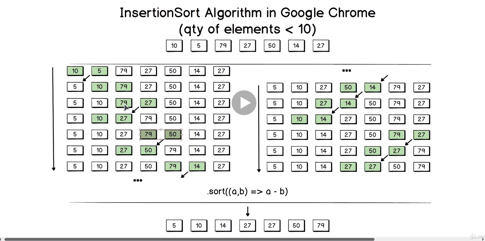
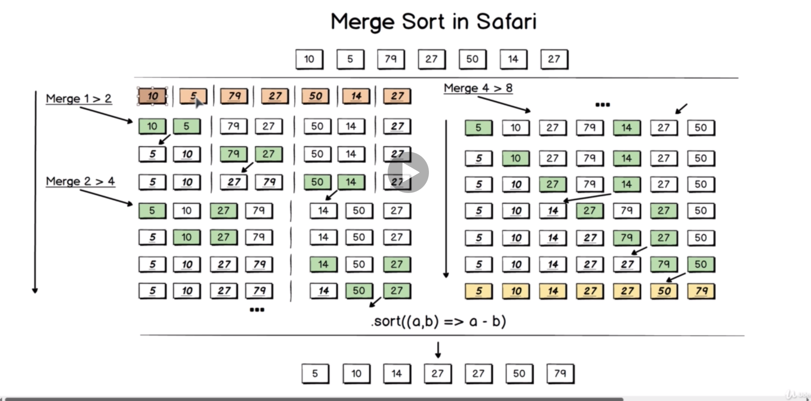

# Javascript Array Helper Methods

- forEach => undefined
- map => New array with same length as input array
- filet => Subarray of the input array/Empty array
- find => Single element/undefined
- every => true/false
- some => true/false
- includes => true/false
- reduce => Single value (number, object, array, boolean, etc.)
- sort => Mutated input array

## Sort Method

  
  
  
- .sort() without arguments all elements in the array will be converted to strings during sorting

- .sort((a, b) => a - b) sort array in ascending order

- Google Chrome, Node.js (V8) - Insertion Sort (Stable, Qty <= 10); QuickSort (NOT Stable, Qty > 10)

- Mozilla Firefox (SpiderMonkey) - Insertion Sort (Stable)

- Safari (Apple's WebKit) - Merge Sort (Stable)

