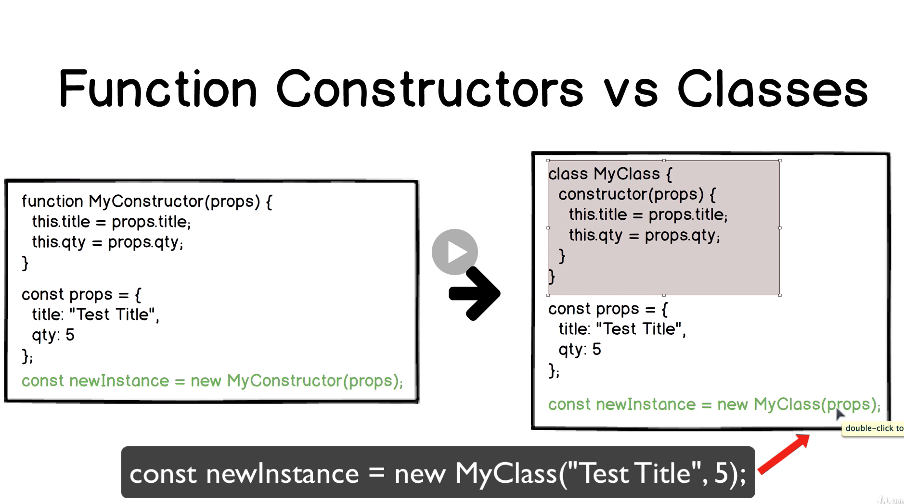
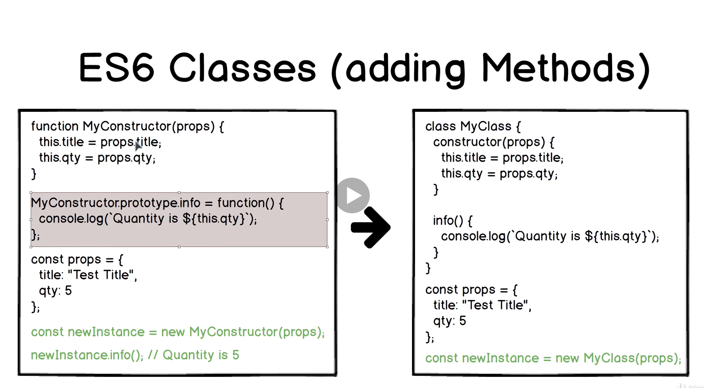

# Javascript Prototypes

## Native prototypes

```js
// Array
const a = [1, 2, 3];

a.__proto__ === Array.prototype // true
a.__proto__.__proto__ === Object.prototype // true
a.__proto__.__proto__.__proto__ === null // true

// String
const b = "Hello World";
const c = new String("Hello World");

b.__proto__ === String.prototype // true
b.__proto__.__proto__ === Object.prototype // true
b.__proto__.__proto__.__proto__ === null // true

// Number
const d = 5;

d.__proto__ === Number.prototype // true
d.__proto__.__proto__ === Object.prototype // true
d.__proto__.__proto__.__proto__ === null // true

// Number
const f = function fn { console.log(this); } ;
console.dir(f);

f.__proto__ === Function.prototype // true
f.__proto__.__proto__ === Object.prototype // true
f.__proto__.__proto__.__proto__ === null // true

// HINT: Arrow functions don't have prototype property
// Every function in Javascript (execept arrow functions) is a constructor function
```

## Insert new Prototype to the prototype chain

```js
// PrototypeTwo
// [[Prototype]]
// PrototypeOne

// Create new function for new prototype
function PrototypeTwo(props) {}
// Reassign value of the "prototype" using "Object.create"
PrototypeOne.prototype = Object.create(PrototypeTwo.prototype)
// Make "constructor" property equal to the function itself
PrototypeOne.prototype.constructor = PrototypeOne
// Call "parent" function if it should add new props to each new instance
function PrototypeOne(props) {
  PrototypeTwo.call(this, props);
}
```

## Classes vs Function Constructors

  
  
